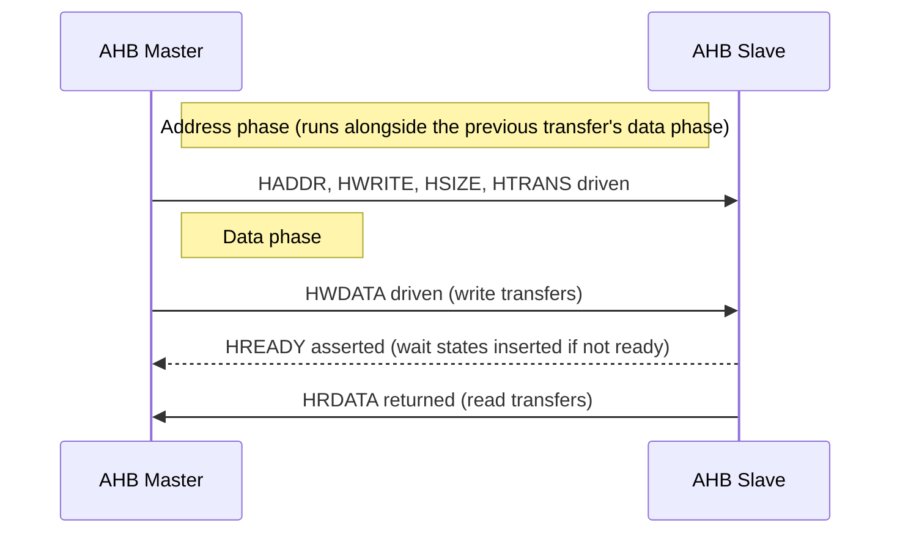
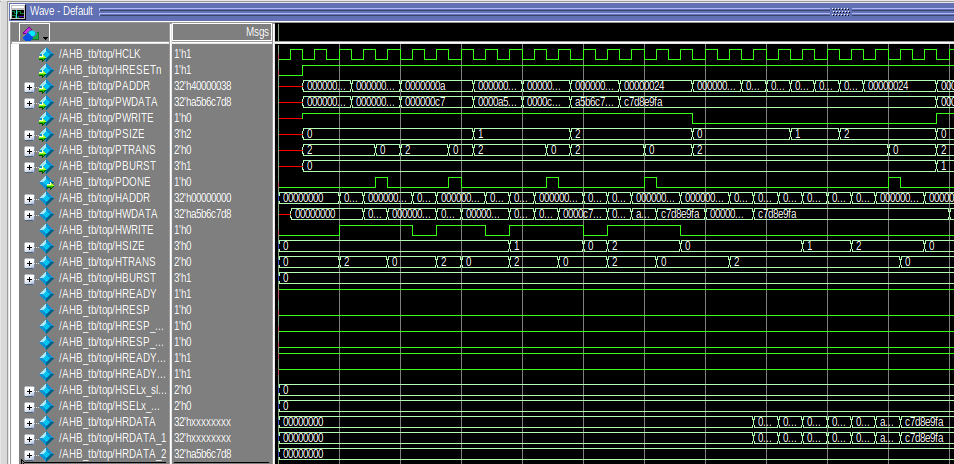
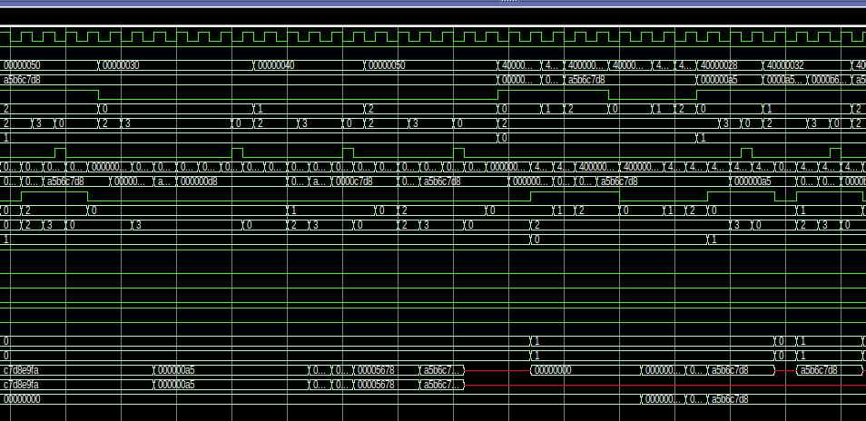
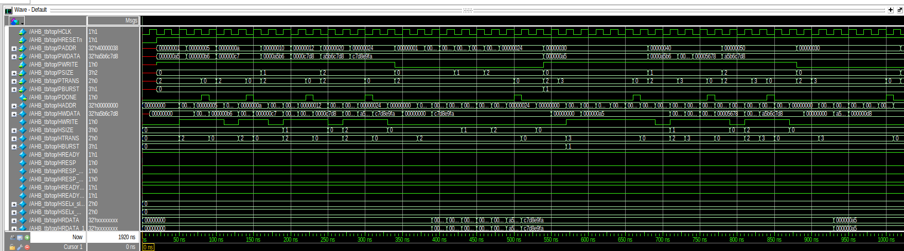
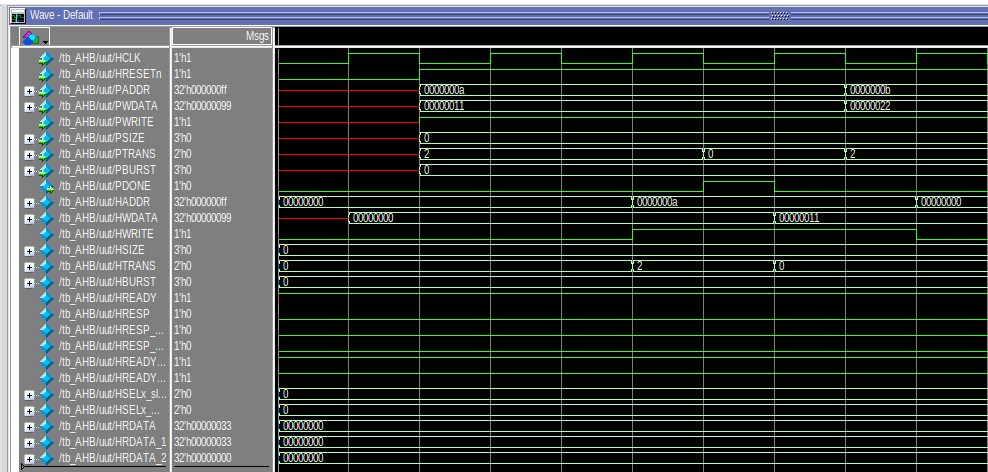
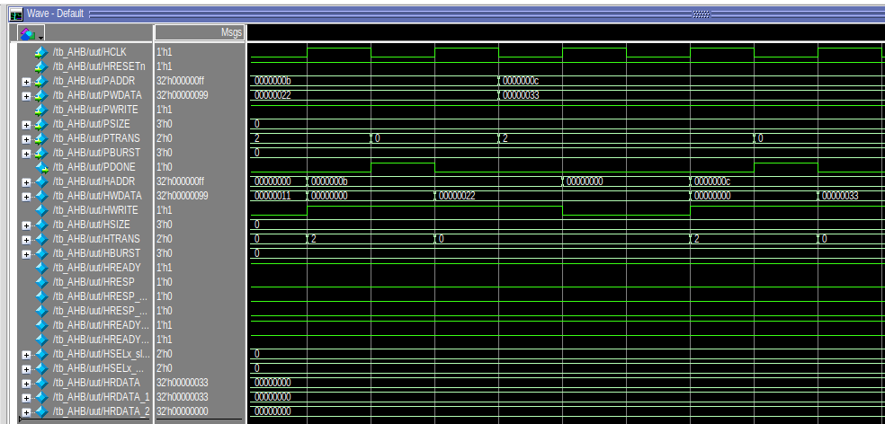
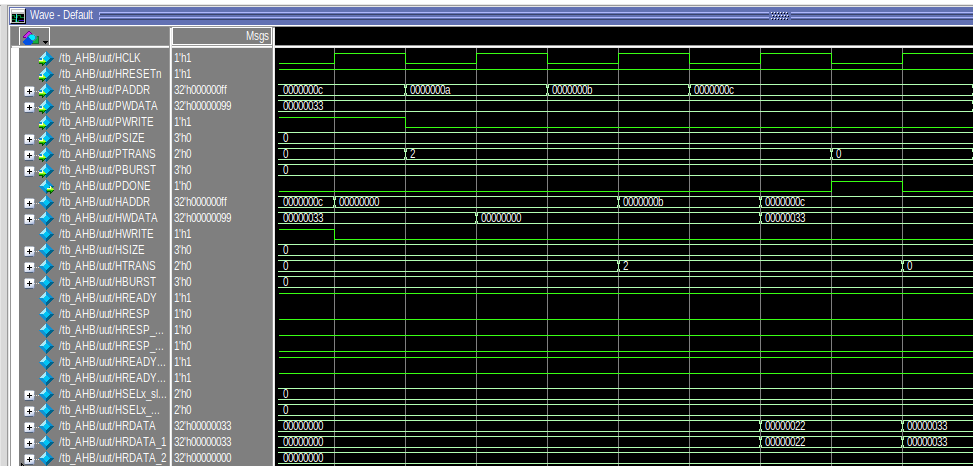
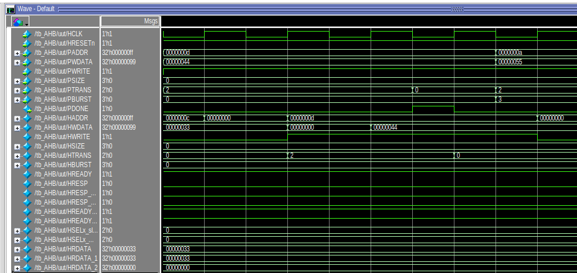
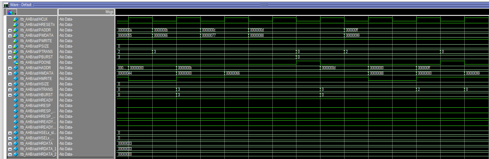

# AMBA AHB-Lite Interconnect & DMA Engine

## Project Overview

This repository contains two related RTL blocks built around the ARM AMBA bus
family:

1. **AHB-Lite Master-Slave Interconnect** — a pipelined bus fabric implementing
   the AMBA Advanced High-performance Bus (AHB-Lite) protocol, built for
   high-throughput, low-latency on-chip communication between a master and
   multiple slaves.
2. **DMA Engine (Week 4 Lab)** — a simple memory-to-memory DMA controller that
   offloads bulk data transfers from the CPU, built on top of a memory-mapped
   bus interface.

---

## Part 1: AHB-Lite Master-Slave Interconnect

### Overview

An RTL design built entirely around the AHB-Lite protocol. The interconnect is
structured for pipelined, high-bandwidth transfers, overlapping the address
and data phases of back-to-back operations to sustain a steady-state
throughput of one transfer per clock cycle.

### Protocol Flow



### Key Features

- **Pipelined transfers** — address and data phases overlap, giving a
  steady-state throughput of one transfer per cycle.
- **Zero-wait-state path** — supports single-cycle completion for both reads
  and writes when no wait states are needed.
- **Wait-state support** — slaves can hold `HREADY` low to insert wait states,
  stalling the pipeline whenever a slave needs extra cycles to respond.
- **Address decoding & multiplexing** — the interconnect decodes the master's
  address to select the target slave and multiplexes the corresponding
  read/response data back to the master.

### Verification

The testbenches exercise the interconnect's address decoding and data
multiplexing logic across the following scenarios:

- **Test Case 1** — Single write transfer, no wait states
- **Test Case 2** — Single read transfer, no wait states
- **Test Case 3** — Write transfer with an inserted wait state
- **Test Case 4** — INCR4 burst transfer (4 back-to-back transfers)
- **Test Case 5** — Access to an invalid address, checking the error response

### Simulation Waveforms

**`AHB_tb` test cases**





**`tb_AHB` test cases**







---

## Part 2: DMA Engine Design (Week 4 Lab)

### Overview

An RTL design of a simple DMA (Direct Memory Access) engine that performs a
**memory-to-memory transfer** without CPU intervention. Rather than having the
CPU move data one word at a time (read → write → read → write ...), the CPU
only configures the transfer — source address, destination address, and
length — and the DMA engine autonomously carries out the transfer, leaving the
CPU free to do other work.

The design has two parts, matching the lab's two tasks:

- **Task 1 — DMA FSM (`dma_fsm.v`)**: the finite state machine driving the
  read → write → increment → done sequence of a single transfer.
- **Task 2 — Full DMA Engine (`dma_top.v` + `memory.v`)**: the FSM integrated
  with a memory interface, address/length registers, a burst counter, and
  status/interrupt signals (`busy`, `done`, `error`, `interrupt`).

### FSM Description

| State | Description |
|---|---|
| `STATE_IDLE` | Waits for `start_transfer`. On assertion, loads `current_src_addr`, `current_dst_addr`, and `transfer_count` from the initial values. |
| `STATE_READ` | Asserts `bus_read_req` to read one word from the source address. |
| `STATE_WAIT_READ` | Holds until `bus_op_done` confirms the read completed. |
| `STATE_WRITE` | Asserts `bus_write_req` to write the buffered word to the destination address. |
| `STATE_WAIT_WRITE` | Holds until `bus_op_done` confirms the write completed. |
| `STATE_INC_ADDR` | Increments `current_src_addr` / `current_dst_addr` by 4 and decrements `transfer_count`. Returns to `STATE_READ` if words remain, otherwise moves to `STATE_DONE`. |
| `STATE_DONE` | Asserts `transfer_done` for one cycle, then returns to `STATE_IDLE`. |

`transfer_active` stays high for the full duration of a transfer (from
`STATE_READ` through `STATE_INC_ADDR`) and drops once the transfer completes.

### Top-Level DMA Engine (`dma_top.v`)

`dma_top` wraps `dma_fsm` and connects it to the `memory` module:

- `bus_read_req` / `bus_write_req` from the FSM drive `memory_read_req` /
  `memory_write_req`.
- `current_src_addr` / `current_dst_addr` drive `memory_read_addr` /
  `memory_write_addr`.
- `memory_read_done` and `memory_write_done` are OR'd together into
  `bus_op_done`, which the FSM uses to know when a bus operation has finished.
- A `data_buffer` register latches `memory_read_data` when a read completes,
  and the buffered value is written back out as `memory_write_data` — the
  FIFO-style read-then-write behavior described in the lab handout.
- `busy` = `transfer_active`, `done` = `transfer_done`.
- `error` is asserted if a transfer is started with `transfer_length == 0`.
- `interrupt` is asserted on transfer completion (`transfer_done`) and cleared
  on the next `start_transfer`.
- `burst_count` loads with `transfer_length` on start and decrements on every
  completed write, tracking how many words remain in the burst.

### Memory Model (`memory.v`)

A simple synchronous single-port memory (4096 x 32-bit words) that:
- Returns `read_data` and pulses `read_done` one cycle after `read_req`.
- Writes `write_data` to `write_addr` and pulses `write_done` one cycle after
  `write_req`.

### Simulation & Verification

Both testbenches configure a transfer with:
- `source_addr = 0x1000`
- `destination_addr = 0x2000`
- `transfer_length = 3` (3 words)

and verify that the FSM correctly reads three consecutive words from the
source region and writes them to the destination region, incrementing
addresses by 4 bytes each time, before asserting `done` / `transfer_done`.

**`dma_top` waveform (`tb_dma`)**

Shows `source_addr`/`destination_addr` being loaded, the read/write address
sequence (`0x1000 → 0x1004 → 0x1008 → 0x100c` and
`0x2000 → 0x2004 → 0x2008 → 0x200c`), the data words being moved
(`0xaaaa0001`, `0xaaaa0002`, `0xaaaa0003`), `burst_count` counting down from 3
to 0, and `busy`/`interrupt` toggling around the transfer.


**`dma_fsm` waveform (`tb_dma_fsm`)**

Shows the FSM-only view of the same transfer: `current_src_addr` and
`current_dst_addr` stepping through the same address sequence in lock-step
with `bus_read_req` / `bus_write_req`, and `transfer_active` /
`transfer_done` bracketing the transfer.


---

## Repository Contents

| File | Description |
|---|---|
| `dma_fsm.v` | DMA FSM design (Task 1) |
| `dma_top.v` | Top-level DMA engine integrating the FSM with the memory interface (Task 2) |
| `memory.v` | Memory module used as the source/destination for DMA transfers |
| `tb_dma_fsm.v` | Testbench for the standalone DMA FSM |
| `tb_dma.v` | Testbench for the full DMA engine (`dma_top`) |
| `waveform_dma_top.png` | Simulation waveform for `tb_dma` |
| `waveform_dma_fsm.png` | Simulation waveform for `tb_dma_fsm` |
| `assets/waveform_tc1.png` – `waveform_tc8.png` | Simulation waveforms for the AHB-Lite interconnect test cases |

## How to Simulate the DMA Engine

Using any Verilog simulator (e.g. Icarus Verilog):

```bash
# FSM-only testbench
iverilog -o tb_dma_fsm.out dma_fsm.v tb_dma_fsm.v
vvp tb_dma_fsm.out

# Full DMA engine testbench
iverilog -o tb_dma.out dma_top.v dma_fsm.v memory.v tb_dma.v
vvp tb_dma.out
```

## Repository

https://github.com/FarazIsmail/AMBA-AHB-protocols
